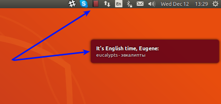

---
__ENHLISS INDICATOR FOR UBUNTU__

Translates random words from english to russian and shows in balloon popup

---

#### Installation
+ Install requirements from `requirements.txt`
+ Copy `config.ini.template` into `config.ini` and replace values:
  - API_KEY - obtain from [documentation](https://tech.yandex.ru/translate/doc/dg/concepts/api-keys-docpage/)
  - MINUTES_INTERVAL - default is 20: once in 20 minutes popup will be shown.
